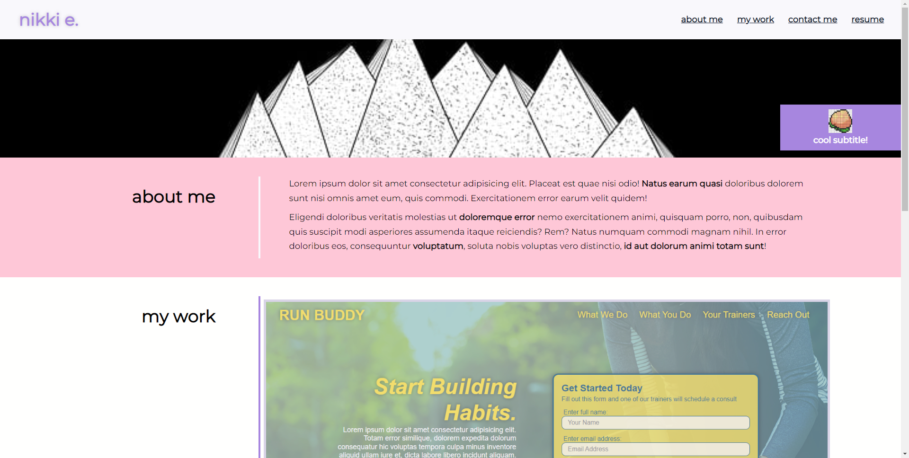
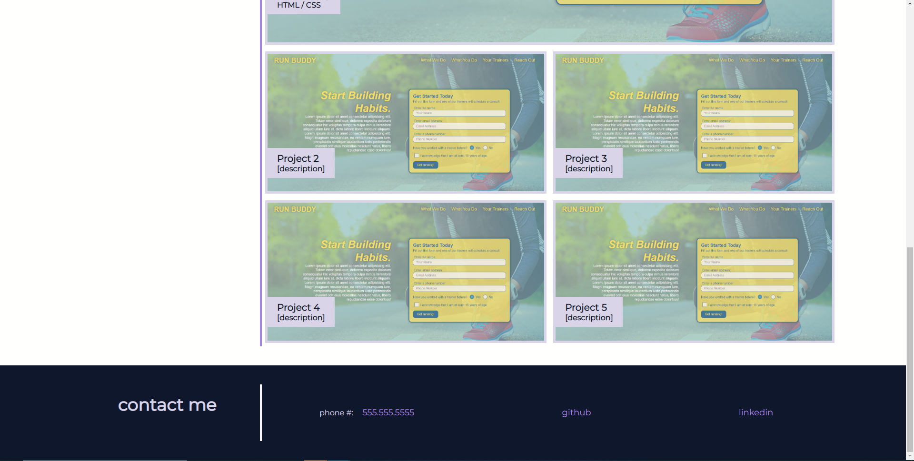

# Module #2 Challenge: Professional Portfolio

## Description

This project is a challenge made from scratch. This challenge involved creating a **sample portfolio website** to showcase our work and skills so far. This project:

* showcases samples of work
* presents the developer's name, an avatar, links to sections about them, their work, and how to contact them
* scrolls to the corresponding section when navigation links are clicked ("*about me*", "*my work*", and "*contact me*" sections)
* under the "*my work*" section, presents titled images of the developer's applications
* showcases the first application project by having the image larger in size than the others, and on its own row (with the exception of the mobile-sized viewing, so readibility purposes)
* links to the deployed application repositories when images are clicked, with placeholders linking to the first official project
* responsive layout from small to large devices, using a **mobile-first** approach

In addition, I have also:

* deployed the live [URL](https://desguerra.github.io/professional-portfolio-example/)
* modified project to function similar to the mock-up given
* added a placeholder link for a **resume** to be attached later
* experimented with the color scheme, Google fonts, and different images to make it more of my own

Here is the link to [the completed challenge!](https://desguerra.github.io/professional-portfolio-example/)

## Table of Contents

* [Screenshots](#screenshots)
* [Credits](#credits)
* [Badges](#badges)

## Screenshots

## Credits

* Color scheme I used can be found [here!](https://www.happyhues.co/)

## Badges

